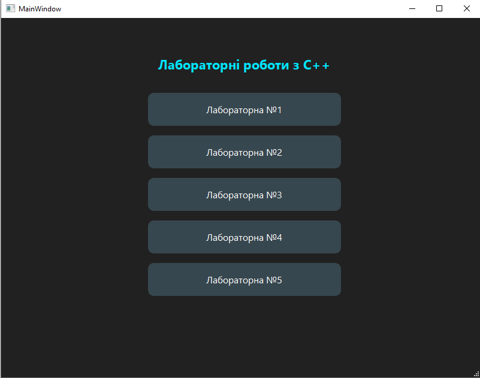
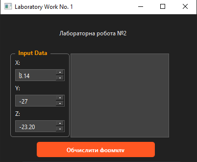
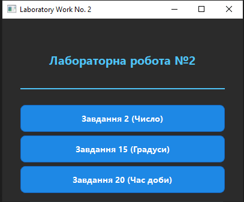
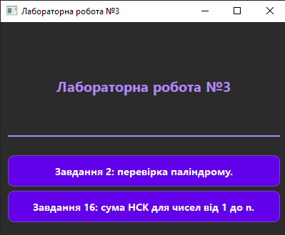
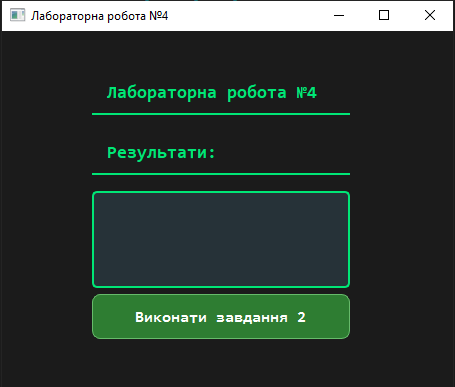
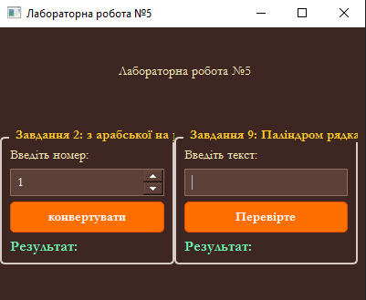

# 📘 C++ Laboratory Works Collection

This repository contains a comprehensive collection of laboratory works for the **C++ Programming Course**. 
The project is wrapped in a unified **Graphical User Interface (GUI)** application built with the **Qt Framework**, allowing easy navigation between different tasks and variants.


## 🚀 Features

*   **Unified Main Menu:** A central dashboard to access all 5 laboratory works.
*   **GUI Implementation:** Interactive forms, buttons, and input validation using Qt Widgets.
*   **Custom Styling:** Professional dark theme with color-coded accents for different labs.
*   **Clean Architecture:** Object-Oriented Programming (OOP) principles applied; each lab is separated into its own class.

---

## 📚 Laboratory Works Overview

### 🧪 Lab 1: Data Types & Operators
**Topic:** Basic algorithmic operations and data types in C++.
*   **Variant 2:** Calculation of a complex mathematical formula involving `double` and `int` types.
*   *Key Concept:* Handling type casting (specifically the modulus operator `%` with floating-point numbers).

### 🔀 Lab 2: Conditional Statements (Branching)
**Topic:** Using `if`, `else`, and `switch` statements.
*   **Task 1:** Check if a number is Positive, Negative, or Zero.
*   **Task 2:** Temperature Converter (Celsius ↔ Fahrenheit).
*   **Task 3:** Determine the Time of Day based on the hour.

### 🔄 Lab 3: Loops
**Topic:** Iterative structures (`for`, `while`).
*   **Task 1 (Palindrome):** Check if a number reads the same forwards and backwards.
*   **Task 2 (Sum of LCMs):** Calculate the sum of the Least Common Multiples for numbers from 1 to *N*.

### 📊 Lab 4: Arrays
**Topic:** Processing one-dimensional arrays and `std::vector`.
*   **Variant 2:**
    1.  Calculate the sum of positive elements.
    2.  Calculate the product of elements located between the absolute maximum and minimum.
    3.  Sort the array in descending order.

### 𝑓 Lab 5: Functions
**Topic:** Modular programming, custom functions, and string manipulation.
*   **Variant 2:** **Arabic to Roman** numeral converter (1 to 3999).
*   **Task 9:** **String Palindrome** checker (ignores case and symbols).

---

## 🛠️ Technologies Used

*   **Language:** C++
*   **Framework:** Qt 6 (Widgets)
*   **IDE:** Qt Creator / Visual Studio Code
*   **Build System:** QMake / CMake
*   **Version Control:** Git

---

## 📷 Screenshots

### Main Menu


### Lab Examples
## Lab 1

## La 2

## Lab 3

## Lab 4

## Lab 5


---

## ⚙️ How to Run

1.  **Clone the repository:**
    ```bash
    git clone https://github.com/YourUsername/CPP-Labs-Collection.git
    ```
2.  **Open the project:**
    *   Open `CMakeLists.txt` or `.pro` file in **Qt Creator**.
3.  **Build & Run:**
    *   Select your Kit (e.g., Desktop Qt MinGW).
    *   Click the **Run** (Play) button.

